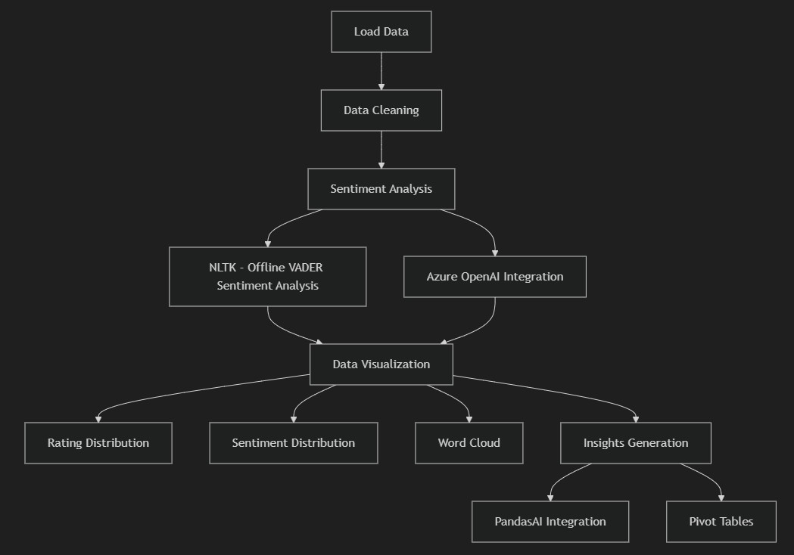
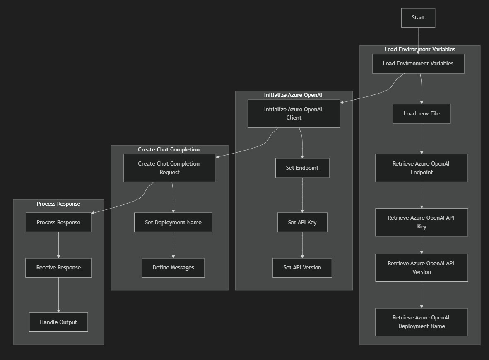

# Project Title: Sentiment Analysis of Amazon Product Review with Azure OpenAI and Data Sciense
## Overview

This project aims to analyze Amazon product reviews using Azure OpenAI and PandasAI. 

* The analysis includes sentiment analysis, data visualization, and generating insights from the reviews. 
* The project leverages various Python libraries such as pandas, streamlit, matplotlib, seaborn, and wordcloud.



## Objectives
- **Sentiment Analysis**: Perform sentiment analysis on Amazon product reviews using Azure OpenAI.
- **Data Visualization**: Visualize the distribution and trends of product ratings and sentiments.
- **Insights Generation**: Generate insights from the reviews using natural language processing (NLP) techniques.

## Milestones
### Data Preparation
- **Load Data**: Import Amazon product reviews dataset into a pandas DataFrame.
- **Data Cleaning**: Clean and preprocess the data, including handling missing values and parsing JSON content.
- **Exploring the data**: Evaluate how much you as a human can understand the data using Data Science Exploration methodology.
- **Chatting with the Data**: Take your curiosity to the next level, and don't feel intimidated to chat with your data.
  



### Sentiment Analysis
- **VADER Sentiment Analysis**: Use VADER sentiment analysis to compute sentiment scores for the reviews.
- **Azure OpenAI Integration**: Integrate Azure OpenAI to perform advanced sentiment analysis and generate insights.

### Data Visualization
- **Rating Distribution**: Create bar plots to visualize the distribution of product ratings over the years.
- **Sentiment Distribution**: Visualize the distribution of sentiment scores using histograms and bar plots.
- **Word Cloud**: Generate word clouds to highlight common words in the reviews.

### Insights Generation
- **PandasAI Integration**: Use PandasAI to query the dataset and generate insights based on user input.
- **Pivot Tables**: Create pivot tables to illustrate the count and distribution of reviews per rating for each year.

## Key Components
- **Jupyter Notebook**: The main analysis and visualization are performed in a Jupyter notebook.
- **Streamlit**: A Streamlit app is used to create an interactive interface for querying the dataset and displaying results.
- **Azure OpenAI**: Azure OpenAI is used for advanced sentiment analysis and generating insights from the reviews.
- **PandasAI**: PandasAI is used to enable natural language queries on the dataset.


## Requirements
- Python 3.x
- pandas
- streamlit
- matplotlib
- seaborn
- wordcloud
- openai
- pandasai
- python-dotenv


## How to Run
1. **Install Dependencies**: Ensure all required libraries are installed. You can use the `requirements.txt` file to install dependencies.
   ```bash
   pip install -r requirements.txt

2. **Run Jupyter Notebook**: Open and run the Jupyter notebook to perform the analysis.
